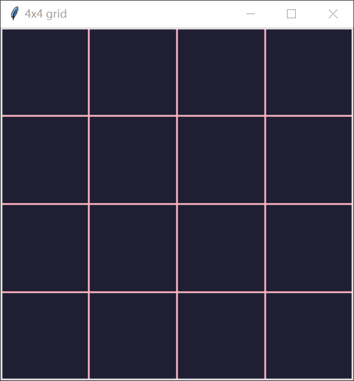

# 基于Python Tkinter库的4x4格子绘制

### 程序实现

程序主要使用Python语言，利用Tkinter库实现格子的绘制

程序的主体为1个Tk window、1个Canvas画布控件与其中的6条线段

线段由Canvas控件的create_line()函数生成，人为计算每条线段起点与终点的坐标，将其指定为函数参数以确定线段的位置，并指定颜色与宽度绘制

### 结果展示
